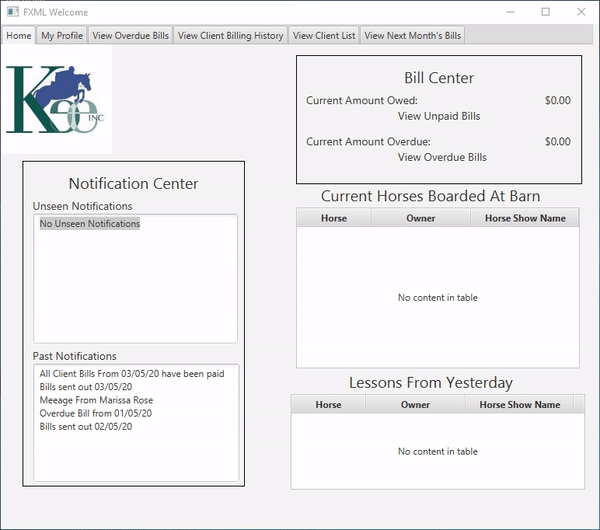

# EquineOrganizer
This is part of a semester-long project for the spring of 2021, and it is a requirements-based project where I partner with a sponsor company. With this company, we go through all the different
fundamental requirements activities. For this part, I built a prototype as a way to validate my requirements. I build this simple prototype as a potential idea of what the system
could look like given the requirements created up to this point. I then presented this to 3 different stakeholders to gain feedback and add to or adjust my requirements.
 

## Demonstration

